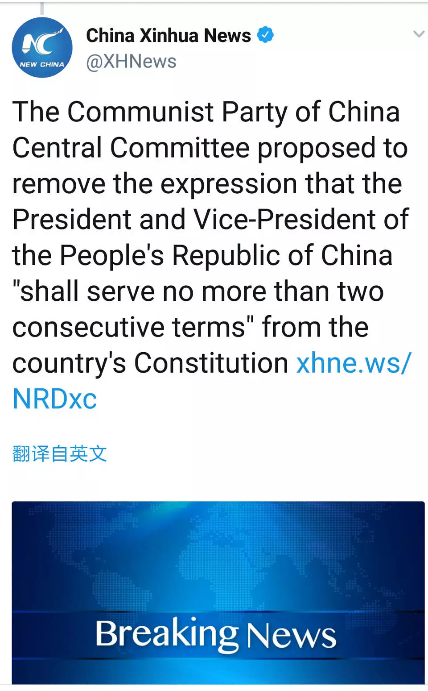
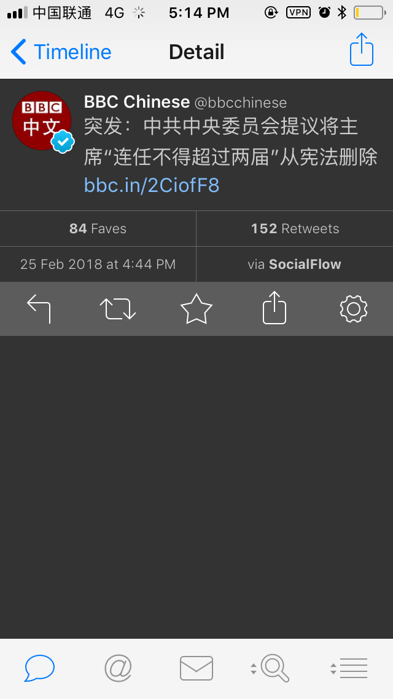
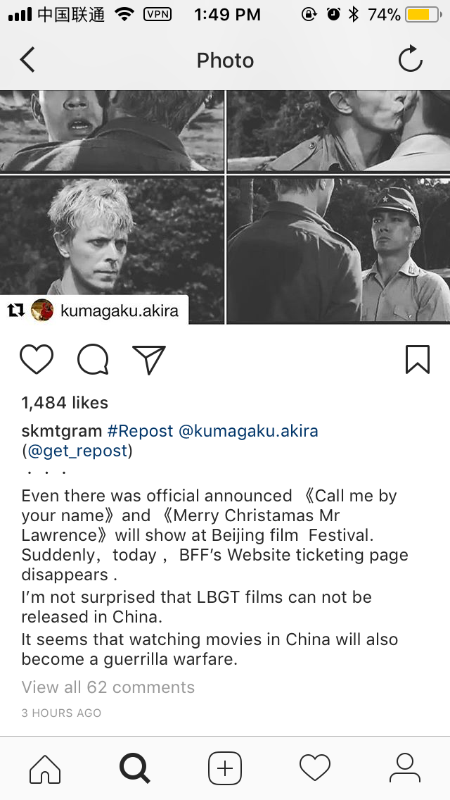
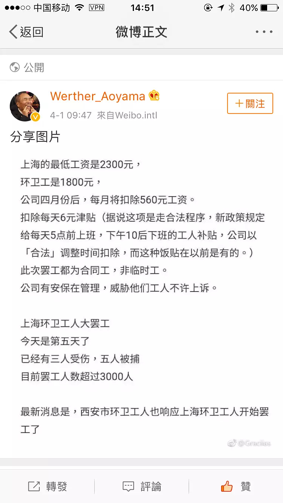
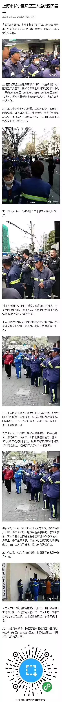

# 截图记事

## 2011 
### 11 月
[上海“11·15”特别重大火灾](https://zh.wikipedia.org/wiki/%E4%B8%8A%E6%B5%B7%E2%80%9C11%C2%B715%E2%80%9D%E7%89%B9%E5%88%AB%E9%87%8D%E5%A4%A7%E7%81%AB%E7%81%BE)

## 2018

### 2月
#### 2月14日

#### 2月25日

### 3月27日

### 4月

#### 4月1日

#### 4月3号
[武汉理工陶崇园同学和“爸爸”教授](./wuhan_papa_professor.pdf)

